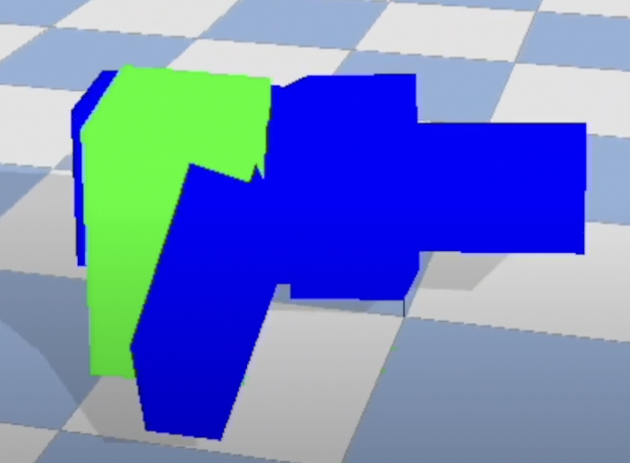
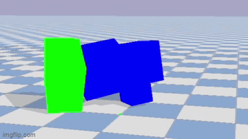
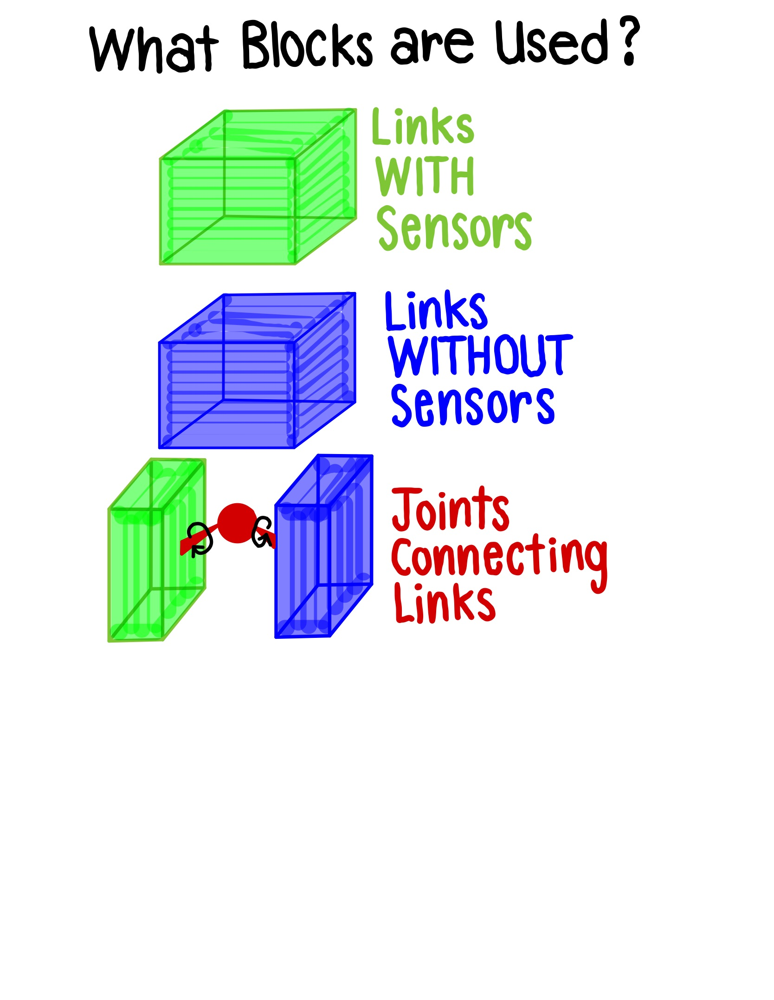
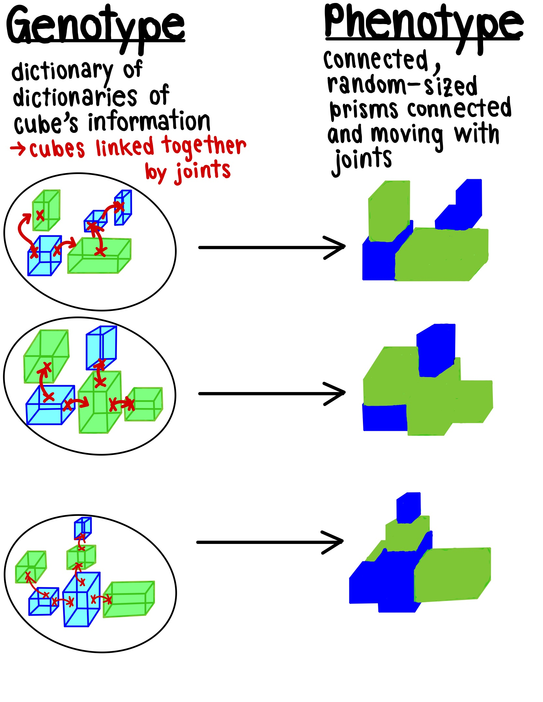
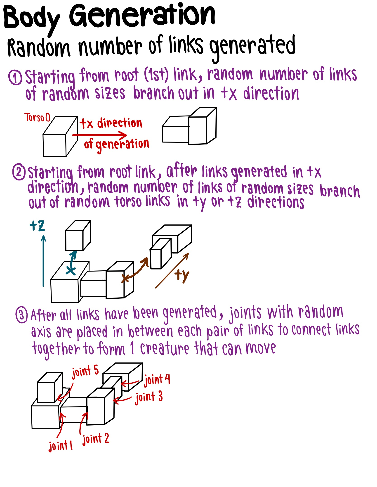
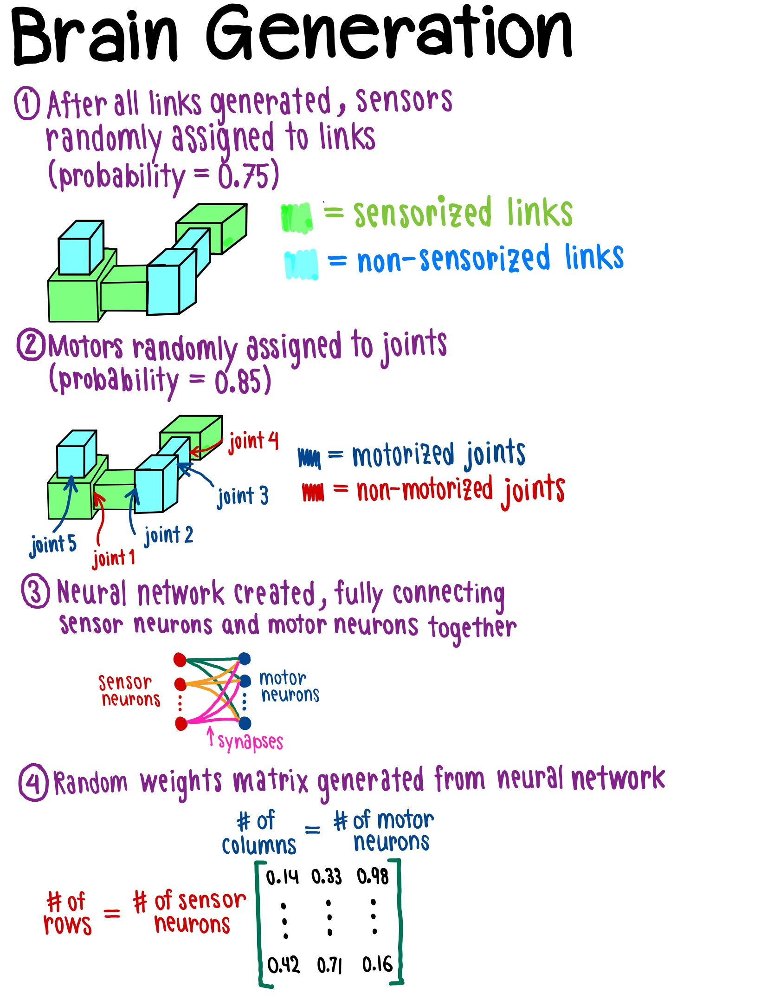
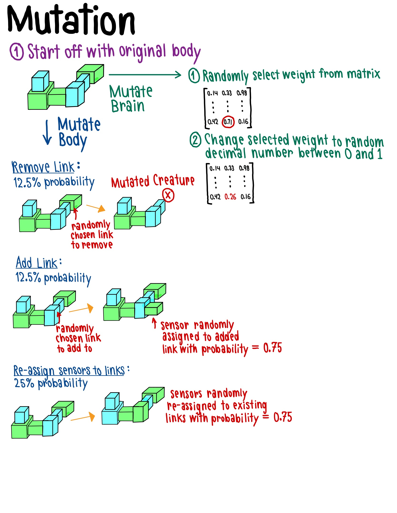
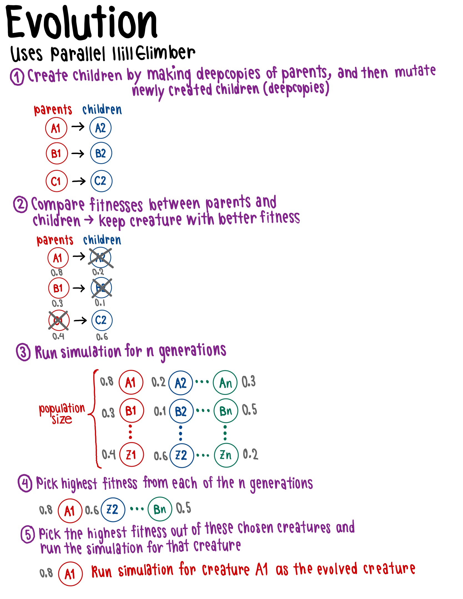
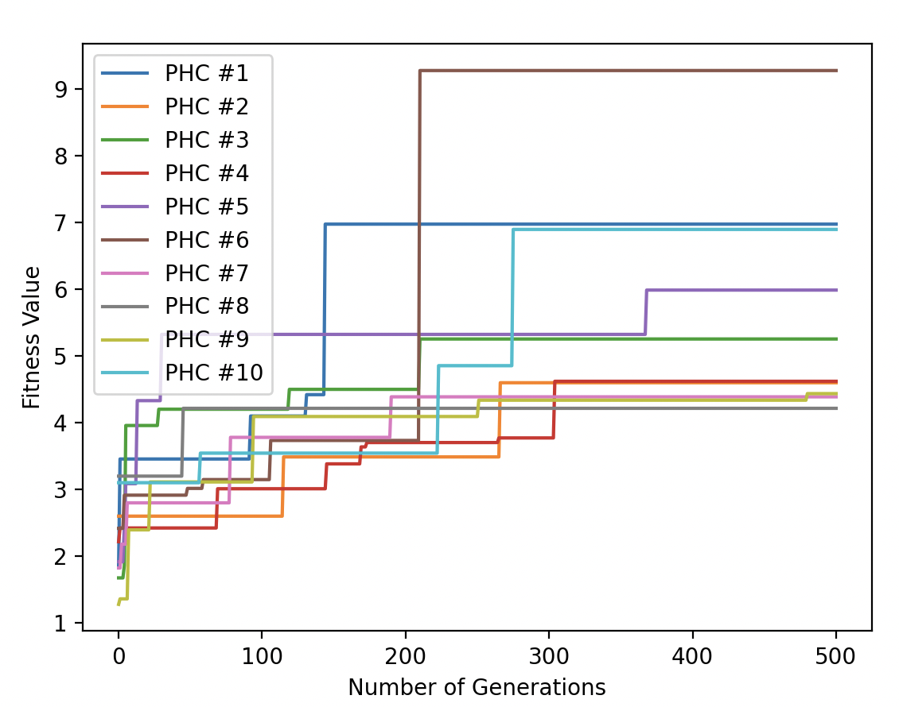

# Final Project 

In this assignment, I used solution.py to generate the 3D creature from asssignments 7-8, which has the following:
1. Random number of links/cubes
2. Random number of sensor neurons, where cubes with sensor neurons are denoted by a green coloring, whereas cubes without sensors neurons are denoted by a blue coloring
3. Random number of motor neurons 

The code randomly generates a set of links and then picking from random links in that set of links, randomly generates another set of links branching off that link. The resulting creature's morphology typically resembles a random blob of cubes as shown below.

<p align="center">                                      
                     
</p>                                                  

# Teaser GIF
Here is a fun GIF showing how the creature moves. :)
<p align="center">                                      
                     
</p>  

# Fitness Function

I defined my fitness function for my creature as the Euclidean distance between the initial x-coordinate of the creature and the final x-coordinate that the creature travelled to, and then used my Select function in ParallelHillClimber.py to select creatures with better fitness.

# Genetics: What is the Creature Made up of?

I have included diagrams showcasing the types of links and joints that make up all of my creatures, both random and evolved, and a genotype to phenotype diagram as well, which showcases how the data structure encoding the information about my links and joints translates to creature generation.

<p align="center">                                      
                     
</p>   

<p align="center">                                      
                     
</p>   
                                                                              
# Brain and Body Generation
Everything in regards to both body and brain generation was randomized from the number of cubes to the number of sensors and motors for the creature. The creature first starts out at an initial position of [0,0,1] with a randomized size vector as well as the joint position being based on the randomized size vector. Then, the following properties were randomized:
* The number of torso links
* The number of leg links
* The number of legs
* The joint axis of the joints
* The size of each link
* The position of the center of the link (with respect to the joint connecting previous link to current link)
* The position of the next joint (with respect to the previous joint)
* The probability of the link having a sensor (75%)
* The probability of the link having a motor (85%)

Additionally, I have provided detailed diagrams of both brain and body generation below.

<p align="center">

</p>

<p align="center">

</p>

# Mutation and Evolution

There were three possible mutations that I implemented for my creature (including mutation combinations):

50% probability for brain mutation
* Altering one of the synapse weights
* Re-randomizing sensor placement throughout the creature

50% probability for body mutation
* 25% probability to add or remove a link:
  * 12.5% probability to add a link to an already existing link
  * 12.5% probability to remove an already existing link, making sure it has no other links after it or a leg branching out of it) 

Note that these probabilities are just arbitraily based on which one is most effective in evolution based on my observations.

Similarly to body and brain generation, I have included figures below detailing the processes of both mutation and evolution.

<p align="center">

</p>

<p align="center">

</p>

# Fitness Curve
Here is my graph containing my ten fitness curves, each one corresponding to a search.py run where I ran each simulation with a population size of 10 for 500 generations, each using a different seed:

<p align="center">

</p>

# Constants
Throughout the duration of the course, I have added many constants, some of which I don't use in the final project. Here is a list of the main constants I use.
* sleepTime: This is automatically set to 1/1000
* populationSize: This is the size of population per iteration
* numberOfGenerations: This is the number of generations that will run per simulation.
* gravity: here I defined gravityX, gravityY, and gravityZ to form the vector [gravityX, gravityY, gravityZ], which is set to [0,0,-9.8] to simulate Earth's gravity
* motorJointRange: this is a constant, which multiplied by the motor angle, determines how the joints in the creature move.

# YouTube Link
Here's a link to my video, which shows the difference between the random and evolved creature (which was cut for time to keep the video ~10 seconds):
https://youtu.be/0P5wL5jHgcE

# Limitations

One technical limitation would be running the creature with more even more generations and randoms seeds and/or a higher population size, since this would make the evolution more random than it already is. Additionally, there are still some issues with movement within some of the creatures that I have been trying to tackle with the time I was given. However, due to the time constraint, I submitted what I could.

# Future Recommendations

To address these limitations, running the simulation with an even higher generation and population size, which would take A LOT of time, would add to evolution even more. Also, if I had more time, I would carefully looking into ways to make my movement more efficient since I struggled with it.

# Things I've Tried in Debugging

I've had MANY struggles in this final project. Firstly, due to my tight schedule, I only had so much time to try and fix the problems that I encountered, mainly in regards to creature movement and positioning. Despite countless hours debugging, I could only go so far, so while this iteration may not be the most perfect creature, I am still proud of it because I did absolutely everything I could with the time I was given. 

I have done several things to make sure everything in my code is as logically sound as it could be:
1. I made sure to look at my fitness function and adjusted it so that it represents the Euclidean distance travelled, as mentioned above, instead of just the x-coordinate of the creature. 

2. I made sure that I was defining my joint and link positions carefully, since I know that this is a problem area for many. I made sure that both my joint and link positions for my root link and joint were absolute, whereas all the other link and joint positions were relative to each other. Notably, if I add add a new joint, that joint's position is relative to the joint before it, and if I add a new link, that link's position is relative to the joint connecting that link with the link before it.

3. I carefully looked at how I was generating my brain and updating number of sensors, number of motors, the links thath and sensors and the links that had motors. Especially with regards to adding and removing links, I made sure that there were no inconsistences, such as forgetting to decrement the number of sensors after removing a sensorized link, that would affect my creature's movement.

4. I tested my creature's movement by increasing my creature's maxForce to 1000 (FOR DEBUGGING PURPOSES ONLY! I changed it back to 150 after finding out the issue). I found that my creature moved under these conditions, so I narrowed down my issue to the sheer size of my creature. Thus, I limited the number of possible links to 7 and shrunk down the random size range from [0.6,1.2] to [0.25,1] to allow for more rectangular links, since I found that the more cubical links struggled to move, whereas the more rectangular links had less trouble with movement.

# How To Run Simulation
In order to run one random simulation, run the following command:
```
python solution.py
```
or alternatively,
```
python3 solution.py
```

References:
- Northwestern University: CS 396 - AI Life
- Education in Evolutionary Robotics
- Pyrosim
- Ludobots (Karl Sim)
