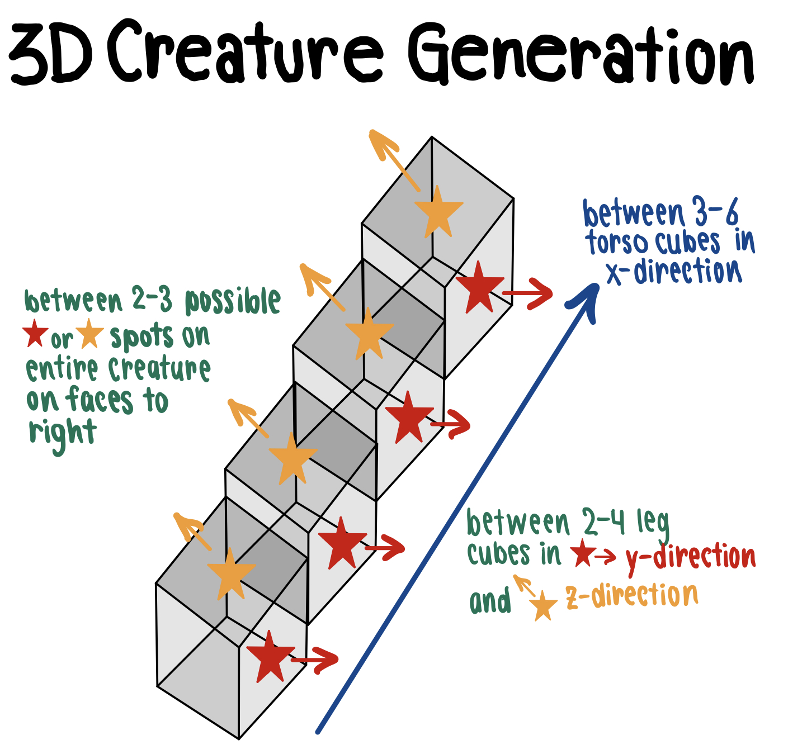
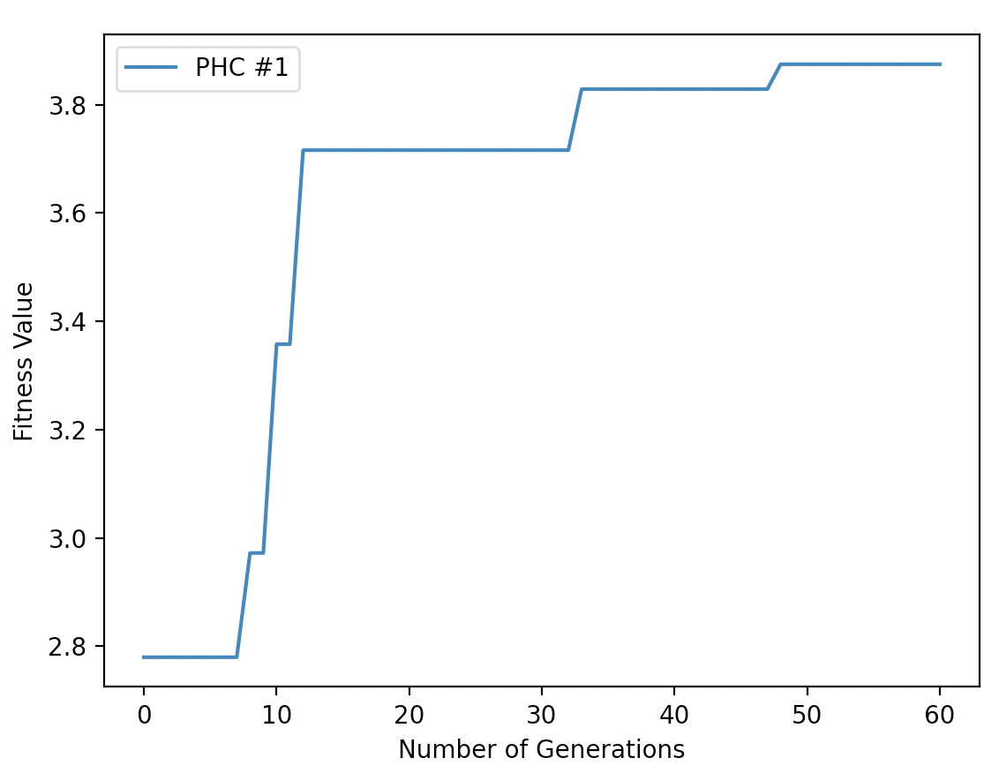
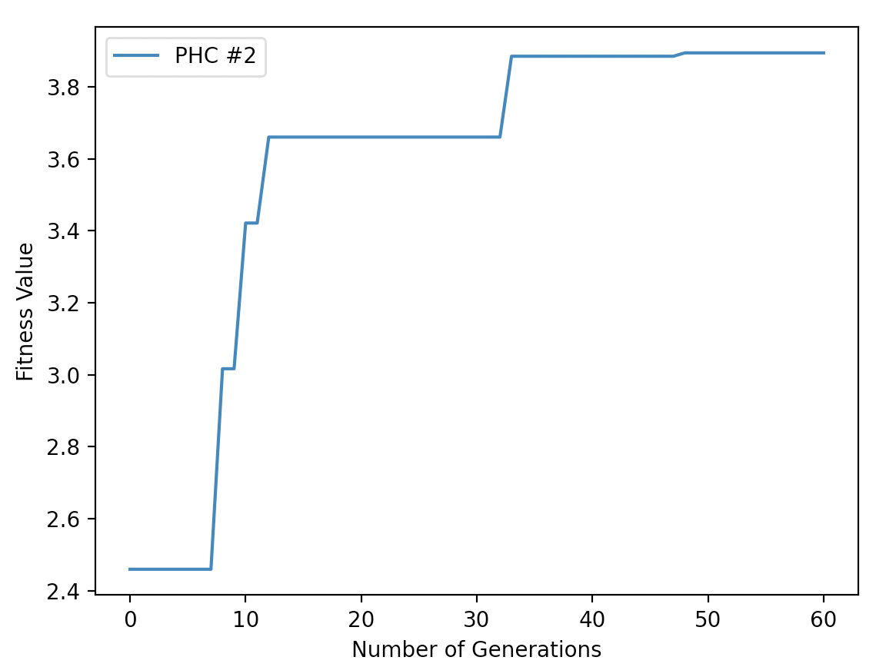
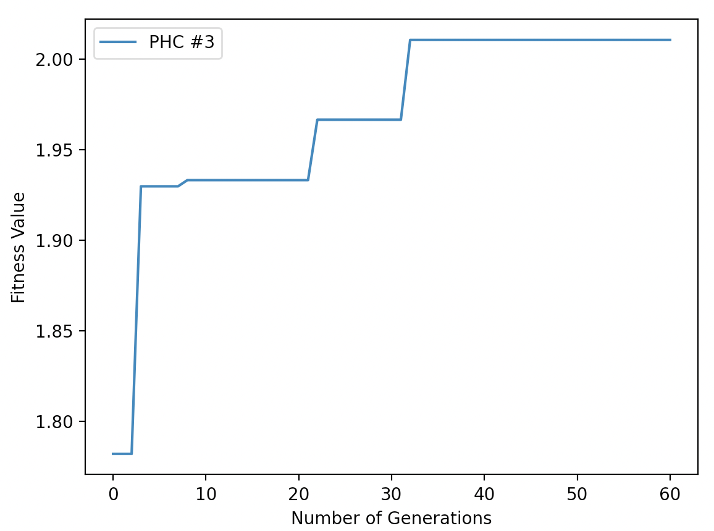
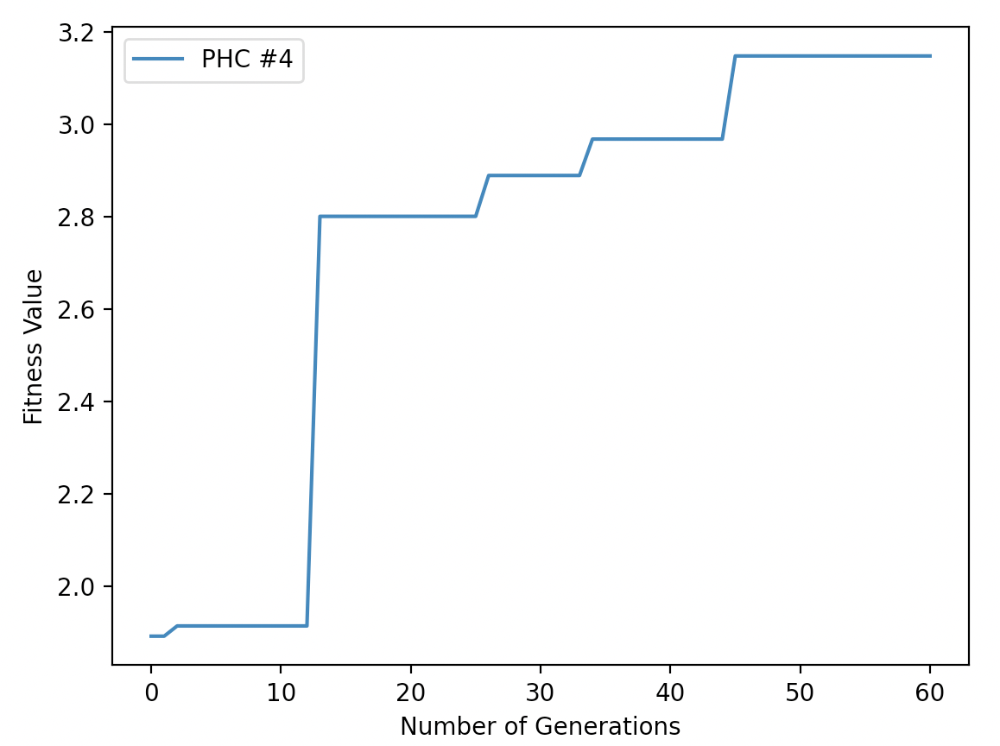
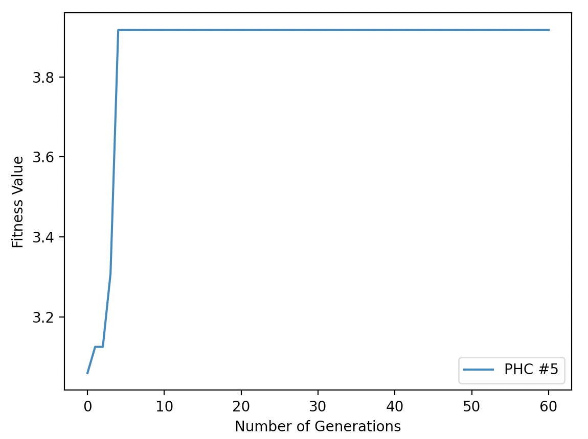

# Assignment 8 - Evolved 3D Creature

In this assignment, I used solution.py to generate the 3D creature from asssignment 7, which has the following:
1. Random number of links/cubes
2. Random number of sensor neurons, where cubes with sensor neurons are denoted by a green coloring, whereas cubes without sensors neurons are denoted by a blue coloring
3. Random number of motor neurons

However, unlike Assignment 7, I re-added the fitness function from the earlier PHC, where the creature evolves by moving as far as it can in the x-direction as its fitness function.

The code randomly generates a set of links and then picking from random links in that set of links, randomly generates another set of links branching off that link. The resulting creature's morphology typically resembles a tree-shape, with some variety, as shown below.

<p align="center">                                      
                     
</p>                                                  

                                                                                       
Additionally, below I have drawn out the process through which the 3D creature is randomly generated, along with the possible random number of links for the torso and the randomly generated legs.

<p align="center">

</p>

In essence, the joints are connected via synapses, which are reprsented by the colored connections below. Each synpase bijectively connects one sensor neuron to exactly one motor neuron, and has a syntaptic weight associated with it. The syntaptic weight is usually a random decimal number such as 0.1342785 as shown below.

<p align="center">

</p>

Here are my five fitness curves, each one corresponding to a search.py run where I ran each simulation with a population size of 7 for 75 generations:
<p align="center">

</p>

<p align="center">

</p>

<p align="center">

</p>

<p align="center">

</p>

<p align="center">

</p>

Here's a link to my video, which shows the difference between the random and evolved creature (which was cut for time to keep the video ~10 seconds):
https://youtu.be/0P5wL5jHgcE

In order to run one random simulation, run the following command:
```
python solution.py
```
or alternatively,
```
python3 solution.py
```

References:
- Northwestern University: CS 396 - AI Life
- Education in Evolutionary Robotics
- Pyrosim
- Ludobots (Karl Sim)
