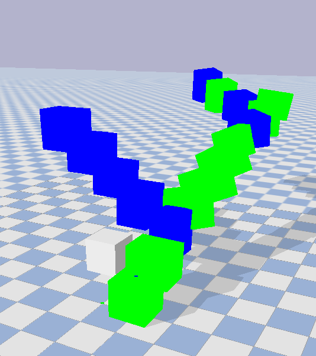

# Assignment 7 - 3D Creature

In this assignment, I create a file 3d_creature.py, based on solution.py, so that it generated a 3D creature with:
1. Random number of links/cubes
2. Random number of sensor neurons, where cubes with sensor neurons are denoted by a green coloring, whereas cubes without sensors neurons are denoted by a blue coloring
3. Random number of motor neurons 

The code randomly generates a set of links and then picking from random links in that set of links, randomly generates another set of links branching off that link. The resulting creature's morphology typically resembles a tree-shape, with some variety, as shown below.

INSERT IMAGE1 AND IMAGE2

<p align="center">                                      
                     
</p>                                                  

<p align="center">

</p>
                                                                                       
Additionally, below I have drawn out an example of what each cube looks like with the associated dimensions of its faces. For instance, the initial cube is shown below.

<p align="center">

</p>

In essence, the joints are connected via synapses, which are reprsented by the colored connections below. Each synpase bijectively connects one sensor neuron to exactly one motor neuron, and has a syntaptic weight associated with it. The syntaptic weight is usually a random decimal number such as 0.1342785 as shown below.

<p align="center">

</p>

In order to run one random simulation, run the following command:
```
python 3d_creature.py
```
or alternatively,
```
python3 3d_creature.py
```

References:
- Northwestern University: CS 396 - AI Life
- Education in Evolutionary Robotics
- Pyrosim
